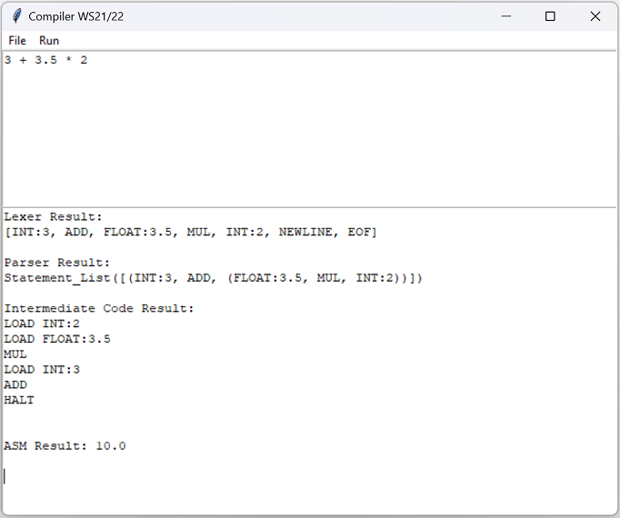

# compilerbau_ws2122_hsbochum
This repository contains the code of the compiler created for module Compilerbau at Hochschule Bochum in Wintersemester 2021/2022 by Khaled Youssef, Henning Nolte and Peter Trost.


# Inhaltsverzeichnis
 - Benutzeroberfläche
 - Lexikalische Analyse
-  Fehlerbehandlung
-  Parser


## Benutzeroberfläche
Das Programm nutzt für die grafische Benutzeroberfläche das Python Paket tkinter. Tkinter steht für "Tk interface" und kann plattformunabhängig unter Windows, Linux und Mac OS benutzt werden.

Mit Tkinter können Datei-Öffnen Dialoge angezeigt werden und die Dateipfade abgespeichert werden. Die lexikalische Analyse (Lexer) greift dann auf die entsprechend ausgewählte Datei zu. 

`  Text()`  Objekte in Tkinter zeigen im oberen Feld dann den eingelesenen Dateiinhalt an, während im unteren Feld Debug-Informationen für den Nutzer sichtbar sind:



Mit dem Klick auf Run wird das Programm ausgeführt.
Das Ergebnis der jeweiligen Zustände wird in vier Ausgabeformate
(Lexer Result, Parser Result, Intermediate Code Result und ASM Result) im Ausgabefenster dargestellt.
## Lexikalische Analyse (Lexer)

### Funktionsweise
Die lexikalische Analyse (im Folgenden "Lexer"), ließt das ausgewählte Dokument zeichenweise nacheinander ein.
Je nachdem, welche Zeichen in der Tokenliste definiert sind, kann es sich dabei um folgende Typen handeln:

- Keywords ( `VAR not or not if else while def then END` )
- mathematische Operatoren ( `+ - * /  ( )` )
- vergleichs Operatoren ( ` = < > ! == != <= >= ` )
- Zahlen ( `0123456789` )
- ASCII-Zeichen

Zahlen sind standardmäßig `INT`. Folgt jedoch im Laufe der Zahl ein `.` wird die Zahl mit dem Token `FLOAT` abgespeichert.
Das Verfolgen der aktuelle Leseposition wird mit der Klasse `Position` realisiert. Am Anfang einer Zeile ist die Position `0` und zählt dann mit jedem Zeichen und Zeile hoch.

Bei der Unterscheidung, ob es sich bei einer Zeichenkette um ein `KEYWORD` oder `Identifier` handelt, wird geprüft, ob sich die Zeichenkette im `Dictionary` der Keywords befindet. Tauchen die Zeichen dort nicht auf, handelt es sich automatisch um einen Identifier.
### Fehlerbehandlung

In der Klasse `Error` wird die Grundfunktionalität für die Fehlerbehandlung definiert. Hier werden auch die `Position`- Daten benötigt, um dem Nutzer die Stelle ausgeben zu können, wo der Fehler im Code vorliegt.

Es gibt drei verschiedene Error-Typen:
- `IllegalCharError`: Tritt im Lexer auf, wenn ein ungültiges Zeichen eingegeben wurde, was keinem Tokentyp zugewiesen werden konnte, oder ein fehlendes Zeichen erwartet wurde
- `IllegalOperatorError`: Tritt im Lexer auf, wenn ungültige Operatoren wie z.B. ++ oder >! benutzt werden
- `InvalidSyntaxError`: Tritt im Parser auf, wenn die Syntax nicht korrekt eingehalten wurde

## Syntaxanalyse (Parser)

Der Parser hat die Aufgabe die vordefinierte Grammatik anzuwenden.
Dazu hat er als Eingabegröße die eingelesene Tokenliste. Diese erhält er vom Lexer.
Der Parser besteht im Grunde aus drei Bestandteilen:
- Parser (zum Übersetzten der Grammatik)
- Nodes (dt.: Knoten, Struktur der Grammatik)
- Parser Result (enthält das finale Ergebnis des Parsers)

Jede Regel der Grammatik ist in dem Node-Ordner als Knotenstruktur hinterlegt.
Eine einzelne Ziffer wird ebenfalls als Knoten definiert.
Das erleichtert im Nachgang das übersetzten vom Parserergebnis zum abstrakten Syntax-Baum.
Dafür sind Konvertierungs-Methoden in den jeweiligen Knotenklassen vorgesehen.
Die Priorisierungen im Parserergebnis werden mittels Klammern visuell wiedergegeben. 

### Grammatik Definition
Die Grammatik unserer Programmiersprache ist folgendermaßen nach der w3 Definition der Notation von Syntax (https://www.w3.org/Notation.html) definiert:    

```ebnf
Program               ::= Statement
Statement             ::= Newline *(Newline | Expression)
  
Expression            ::= "VAR" Identifier "EQ" Expression  
	                | Comparison_Expression *(("AND"|"OR") Comparison_Expression)  
  
Comparison_Expression ::= "NOT" Comparison_Expression
                        | Arithmetic_Expression *(("EQ"|"NEQ"|"GT"|"GTE"|"LT"|"LTE") Arithmetic_Expression)
  
Arithmetic_Expression ::= Term *(("PLUS"|"MINUS" Term)
  
Term                  ::= Call *(("MUL"|"DIV") Call)
  
Call                  ::= Factor ?("(" ?(Expression *("," Expression)) ")")
  
Factor                ::= Negative Number
                        | "INT" | "FLOAT" Number
                        | Identifier | Saved_Variable
                        | String
                        | "()"-Prioritisation
                        | While_Expression
                        | If_Expression
                        | Function_Definition
                        
While_Expression      ::= "while" Expression "then" Expression
                        | Newline Statement "END"
                        
  
If_Expression         ::= "if" Expression "then" Expression
                        | Newline Statement "END"
                        | ?Else_Expression
  
Else_Expression       ::= "else" Expression
                        | Newline Statement "END" 
  
Function_Definition   ::= "def" ?Identifiere "(" ?(Identifier *("," Identifier)) ")" ":" Expression
  
String                ::= <any character>

Number                ::= PosNum *Digit ("."*Digit) | Digit ("." *Digit) | Digit

Digit                 ::= "0" | PosNum  
  
PosNum                ::= "1" | "2" | "3" | "4" | "5" | "6" | "7" | "8" | "9"  

Legend:
* ::= means reciprocal
? ::= means not necessary
```
